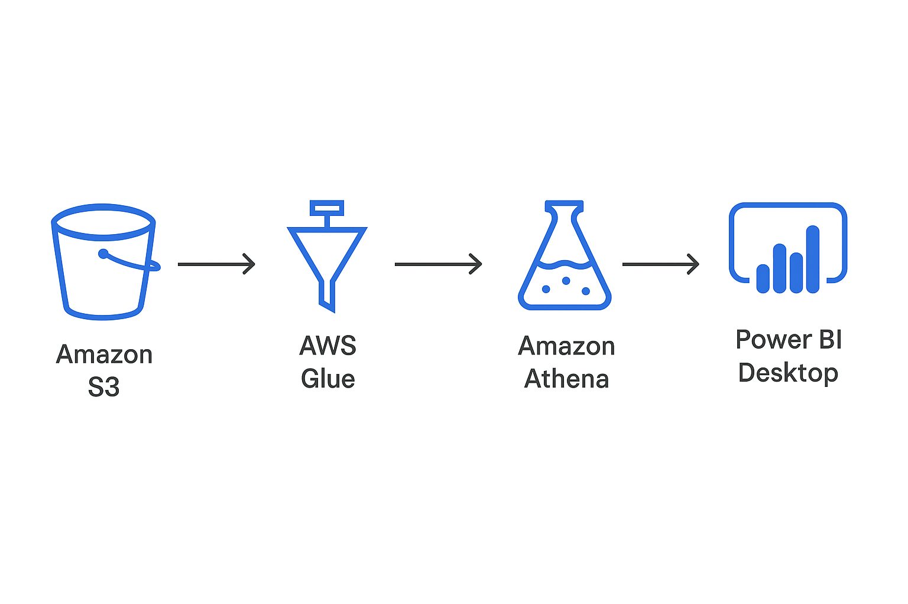

# 🛍️ Retail Insights ETL + Power BI Visualization

This project demonstrates an end-to-end Retail Analytics Data Pipeline using AWS services and Power BI for visualization.

## ☁️ Cloud Stack Used
- **Storage**: Amazon S3 (raw + processed)
- **Processing**: AWS Glue
- **Query Layer**: Amazon Athena
- **Visualization**: Power BI Desktop

## 🧭 Architecture Overview


## 📊 Power BI Dashboard Features
- Total Revenue (KPI Card)
- Monthly Sales Trend (Line Chart)
- Store-wise Sales (Bar Chart)
- Top Selling Products (Bar Chart)
- Payment Method Split (Donut Chart)
- Filters: Date, Store, Payment Method

📂 Power BI File: `powerbi_dashboard/Retail_Sales_Dashboard.pbix`

## 🧪 Sample Athena Query
```sql
SELECT store_location, SUM(total_amount) AS total_sales
FROM retail_real_data
WHERE total_amount IS NOT NULL
GROUP BY store_location
ORDER BY total_sales DESC;
```

## 🧷 Dataset Link
[Retail Transactions Dataset (Kaggle)](https://www.kaggle.com/datasets/kyanyoga/sample-sales-data)

## 📁 Folder Structure
```
retail-insights-etl-powerbi/
│
├── README.md
├── architecture.png
├── dashboard_preview.png
├── powerbi_dashboard/
│   └── Retail_Sales_Dashboard.pbix
```

